# List of current emoticon expressions:

- Action 

- Aggro 

- Anxiety 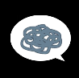

- Chat 

- E 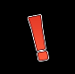

- EQ 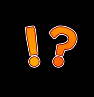

- Q 

- Heart 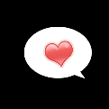

- Idea 

- Note 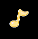

- Shy 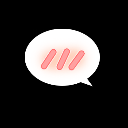

- Sweat 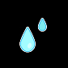

- Twinkle 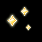

- Bulb 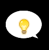

- Sad 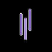

- Sigh 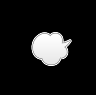

- Tear 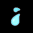

- Steam 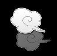
