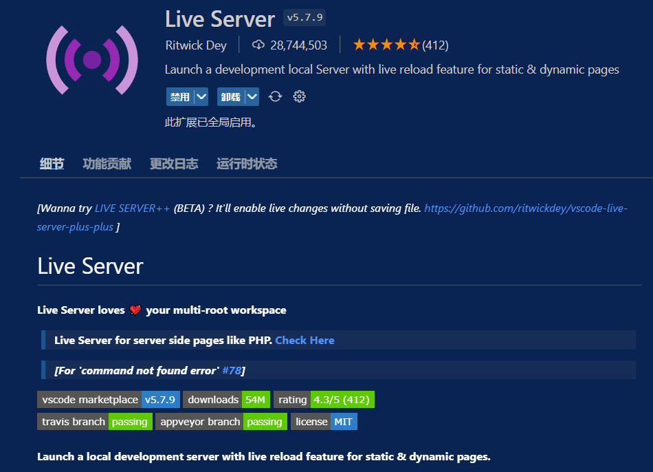
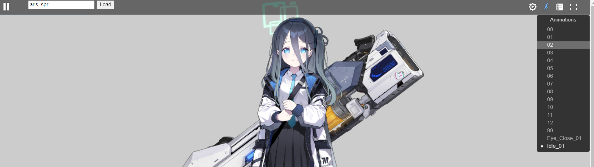

# preview emoticon method

Start the local web server with the Data folder as the root directory. Here is a method

1. Download [VS Code](https://code.visualstudio.com/)
2. Install the plug-in Live Server
    
3. Start `Live Server` 
4. Enter the name of the character file to be previewed in the browser, and click `load` to load
    
